# Dependencies for Tool Installation
```
sudo apt-get update
sudo apt-get upgrade
sudo apt install gcc
sudo apt install csh
sudo apt-get install m4
sudo apt-get install tcsh
sudo apt-get install libx11-dev
sudo apt-get install tcl-dev tk-dev
sudo apt-get install libcairo2-dev
sudo apt-get install mesa-common-dev libglu1-mesa-dev
sudo apt-get install libncurses-dev
sudo apt-get install flex
sudo apt-get install bison
sudo apt-get install libxpm-dev
sudo apt-get install libxaw7-dev
sudo apt-get install libreadline6-dev
sudo apt-get install libxmlb2
sudo apt-get install libboost-all-dev
sudo apt-get install lp-solve
sudo apt-get install gdebi
```

# Tool Installation 

Note: After installing every tool, navigate back to home/<username> directory.

## 1. Xschem - Schematic Capture Program

```
$ git clone https://github.com/StefanSchippers/xschem.git xschem_git
$ ./configure
$ make
$ sudo make install
```
## 2. Ngspice - Opem-source simulator

Download ngspice tar.gz file from sourceforge.net. Current version is 39.

```
$ tar -zxvf ngspice-39.tar.gz
$ cd ngspice-39
$ mkdir release
$ cd release
$ ../configure --with-x --with-readline=yes --disable-debug
$ make
$ sudo make install
```

## 3. Netgen - Compares netlists specifically LVS (Layout vs Schematic)

```
$ git clone git://opencircuitdesign.com/netgen
$ cd netgen
$ ./configure
$ make
$ sudo make install
```

## 4. Magic - VLSI layout tool

```
$ git clone git://opencircuitdesign.com/magic
$ cd magic
$ ./configure
$ make
$ sudo make install
```

## 5. open-pdks - Process Design Kit for sky130 process

```
$ mkdir pd_working_dir
$ cd mkdir pd_working_dir 
$ git clone git://opencircuitdesign.com/open_pdks
$ cd open_pdks
$ ./configure --enable-sky130-pdk
$ make
$ sudo make install
```
## 6. Klayout - Layout viewer

Download the .deb installation file from KLayout Downloads page (suiting your OS)
```
cd Downloads
sudo gebi klayout_0.28.5-1_amd64.deb #use your downloaded file name
```

## 7. ALIGN - Intelligent tool to generate layout from schematic

```
$ export CC=/usr/bin/gcc
$export CC=/usr/bin/g++
$ git clone https://github.com/ALIGN-analoglayout/ALIGN-public
$ cd ALIGN-public

# use to instantiate ALIGN(virtual environment)- use every time you want to use the tool from the ALIGN-public directory
$ python3 -m venv general  
$ source general/bin/activate 

$ python3 -m pip install pip --upgrade

$ pip install -v .
$ pip install -e .

pip install setuptools wheel pybind11 scikit-build cmake ninja
pip install -v -e .[test] --no-build-isolation
pip install -v --no-build-isolation -e . --no-deps --install-option='-DBUILD_TESTING=ON'

git clone https://github.com/ALIGN-analoglayout/ALIGN-pdk-sky130
cd ALIGN-pdk-sky130
cp SKY130_PDK ../pdks/

#test

#instantiate the virtual env.
mkdir test
cd test
schematic2layout.py ../examples/five_transistor_ota -p ../pdks/SKY130_PDK/
#viee generated files using Klayout

```

# Creation of Working Directory - to link all tools to sky130 pdk

```
$ mkdir Week0
$ cd Week0
$ mkdir mag
$ mkdir netgen
$ mkdir xschem
$ cd xschem
$ cp /usr/local/share/pdk/sky130A/libs.tech/xschem/xschemrc .
$ cp /usr/local/share/pdk/sky130A/libs.tech/ngspice/spinit .spiceinit
$ cd ../mag
$ cp /usr/local/share/pdk/sky130A/libs.tech/magic/sky130A.magicrc .magicrc
$ cd ../netgen
$ cp /usr/local/share/pdk/sky130A/libs.tech/netgen//sky130A_setup.tcl .
```
  

# Successful tool installation verification

|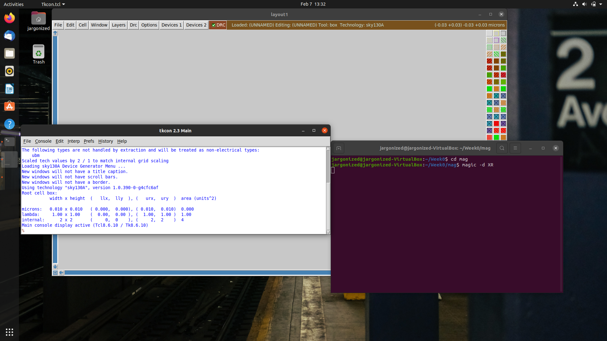 | 
|:--:| 
| Magic |

| 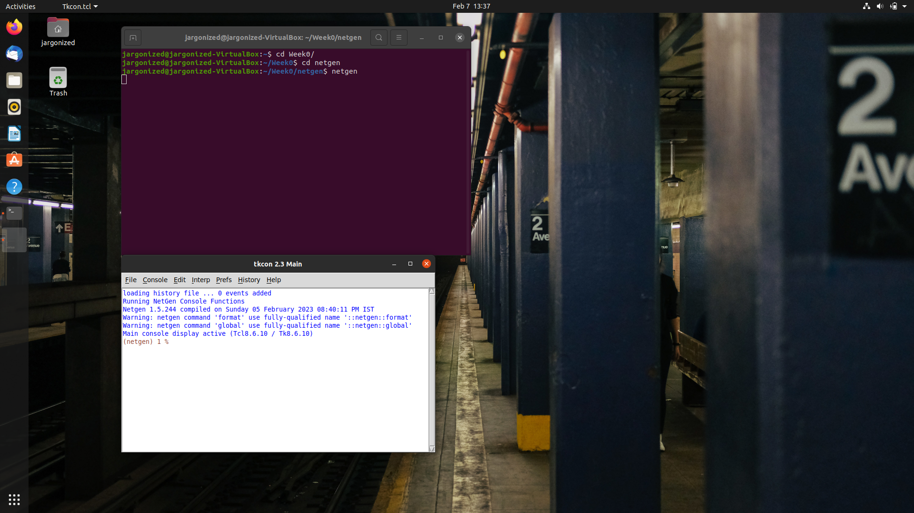 | 
|:--:| 
| Netgen |

| 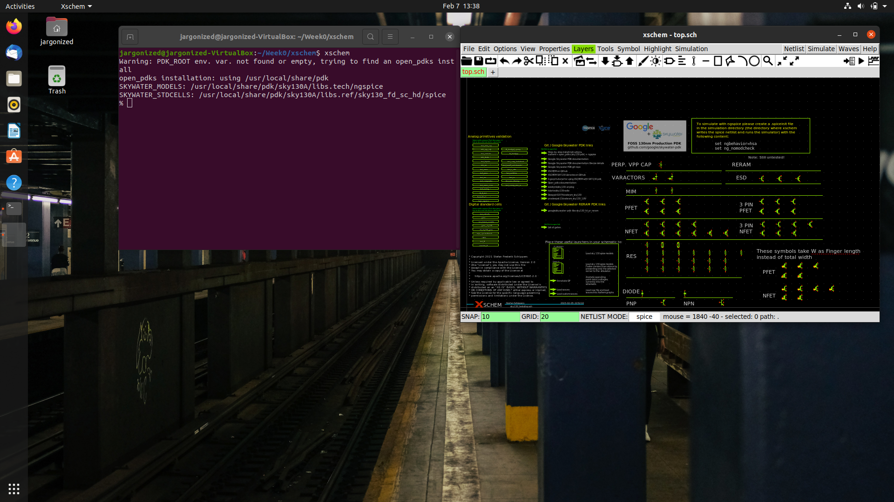 | 
|:--:| 
| Xschem |

| 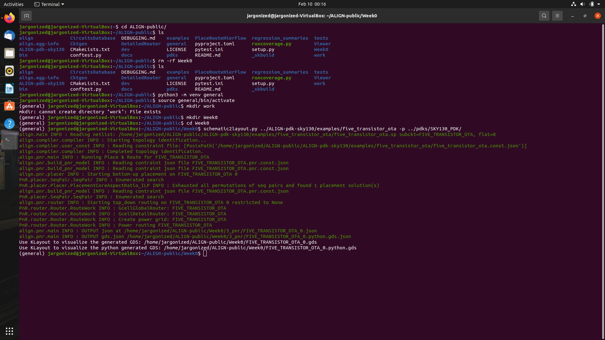 | 
|:--:| 
| ALIGN |
  
# Creation of Inverter using Xschem

```
#pwd: /home/jargonized 
cd Week0
cd xschem
xschem
```

Create an inverter circuit as shown. Use Shift+I to insert symbols. Under the pdks folder shown by the tool manager, choose pfet and nfet symbols for 1v_80. Use ipin.sym and opin.sym for input and output ports and use iopin.sym for supply ports. Use 'W' key for wiring.

| 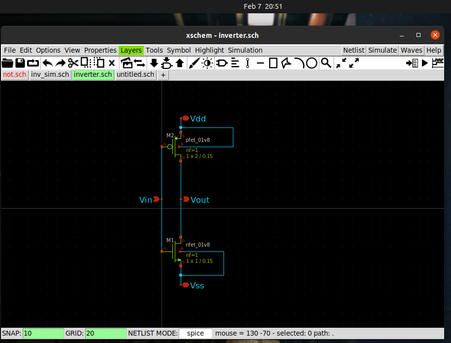 | 
|:--:| 
| Inverter Circuit|

Use 'A' key to create a symbol file for the circuit created. Create a new schematic for simulation. Select supply sources from devices under the symbols library and create the following setup. Spice netlist commands are added using code_shown.sym
 
| 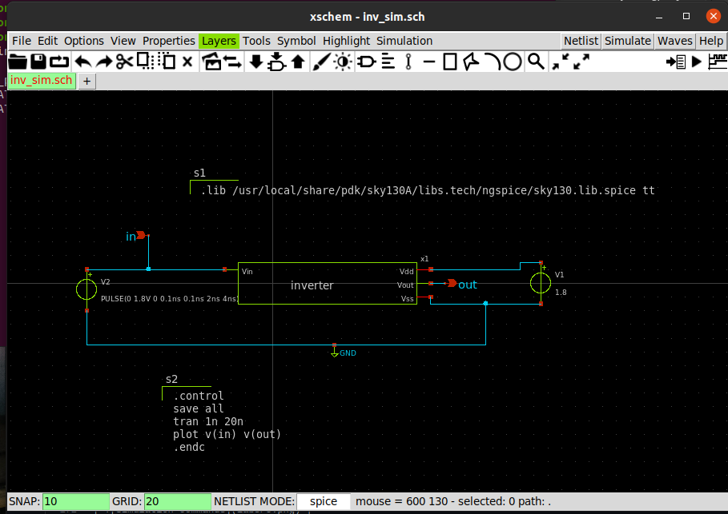 | 
|:--:| 
| Inverter Testbench Circuit|

Click on Netlist on top-right of the window. It will create the netlist for the simulations under /home/<username>/.xschem/simulations/ 
Click on Simulate. Ngspice window will open. You can now view the plot.
  
| 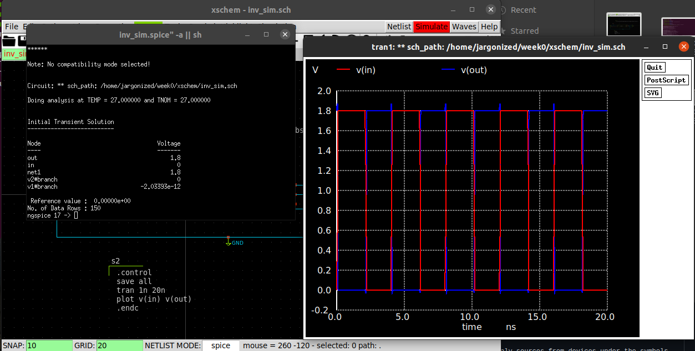 | 
|:--:| 
| Simulated Output|

# Pre-layout Characterisation

Values taken for calculation: 50% = 0.9V; 20%=0.36V; 80%=1.44V

```
Input Rise Time = 61.78 ps
Input Fall Time = 60.52 ps
Output Rise Time = 41.7 ps
Output Fall Time = 33.89 ps
Rise Propagation Delay = 22.4358 ps
Fall Propagation Delay = 22.22 ps
``` 
| 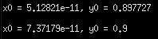 | 
|:--:| 
| Example value capture|

# Importing netlist and working with magic
 
Navigate to mag directory. Use ``` magic -d XR``` to open magic. Under the file menu, use import spice to import the netlist inverter.spice
  
An empty inverter cell will be visible with black bounding box. Move cursor over the cell and press 's'. Then press 'x'. The four metal contacts and two empty fet cells will be visible.
  
NFET and PFET devices should be created using the Devices menu. Create nfet and pfet devices by referring to values given in [3] and [4]. Save the .mag files under the default name shown. Navigate to mag folder using the terminal and rename the files to match the missing cell name displayed on the tkcon window.

Reload inverter.mag and expand the cell. NFET, PFET and the metal contacts will be visible. Place the cells as shown below using the move command. 

Note: For moving elements, 's' to select metal contacts and 'i' to select cells.

Use [1] as reference to learn about the wiring tool. You can alternate between wiring and box tool by pressing the space bar and ```:tool box``` respectively.

Route the design as shown.

| 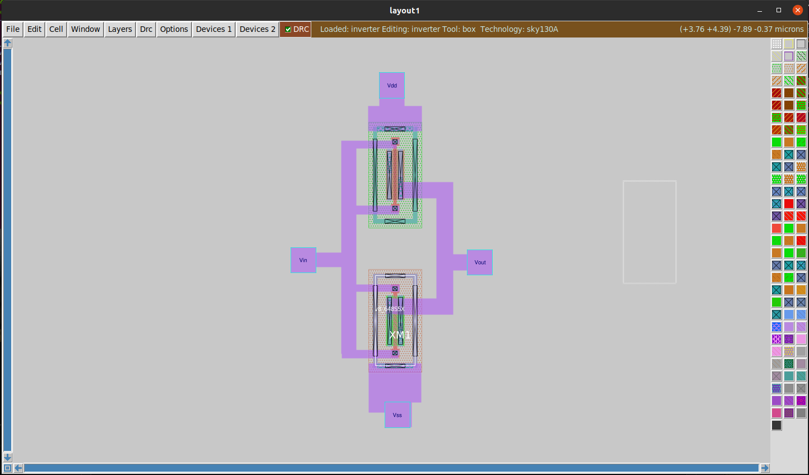 | 
|:--:| 
| Modified layout after importing|

After the layout, extract netlist for post-layout characterisation. Use the following commands in the tkcon window.
```
extract do local
extract all
ext2spice lvs
ext2spice
```
Perform LVS check on the pre-layout and post-layout netlists.

```
netgen -batch lvs "../mag/inverter.spice inverter" "../../.xschem/simulations/inv_sim.spice inverter"

```
| 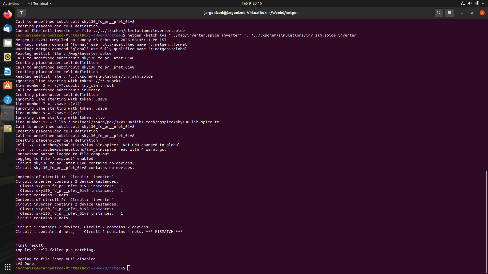 | 
|:--:| 
| Successful LVS check|  

# Pre-layout characterisation of fn_prelayout.cir

Error: using sky130 PTM file for my_model_file.tech. Unable to parse

# Post-layout characterisation of fn_postlayout.mag
| 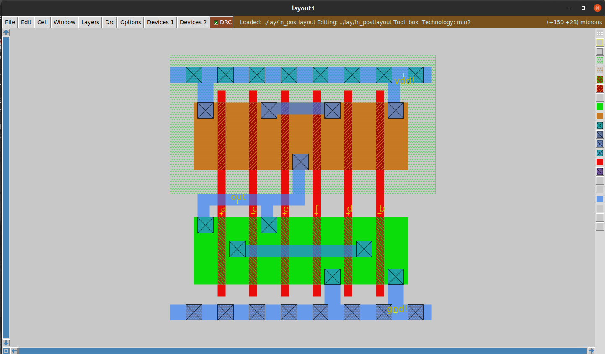 | 
|:--:| 
| Layout|  

| 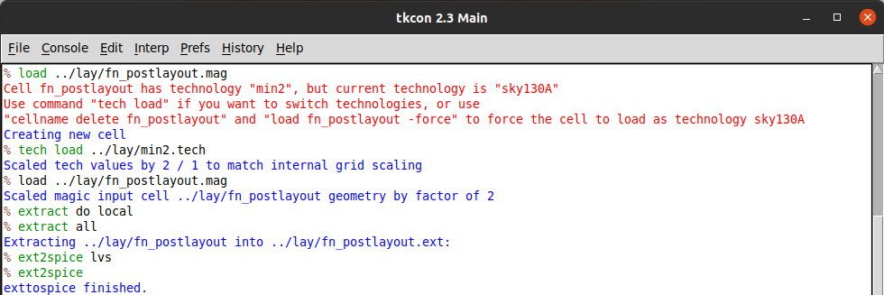 | 
|:--:| 
| Commands to extract spice file|  

# Bugs

1. ALIGN unable to parse the netlist extracted from xschem
2. Post-layout simulation does not match

| 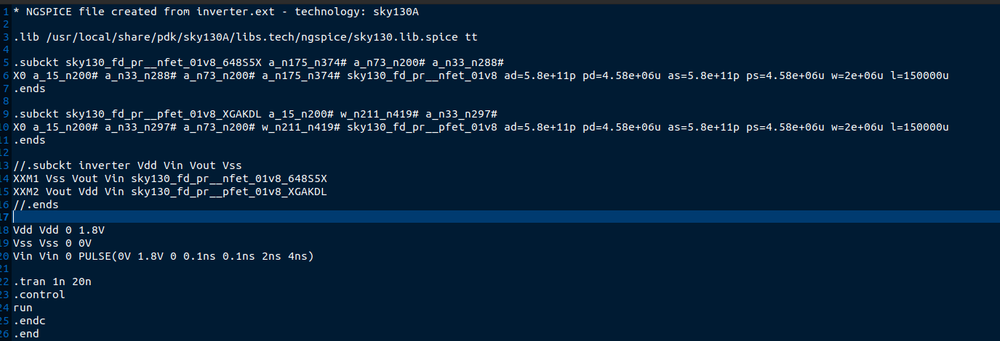 | 
| 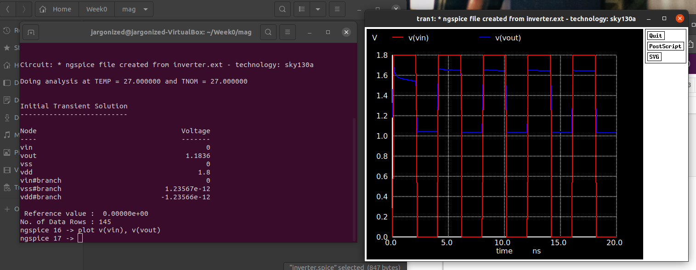 | 
| 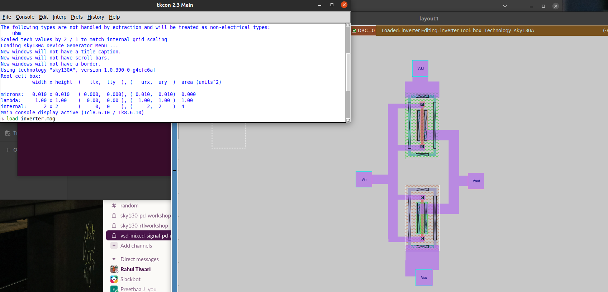 | 
| 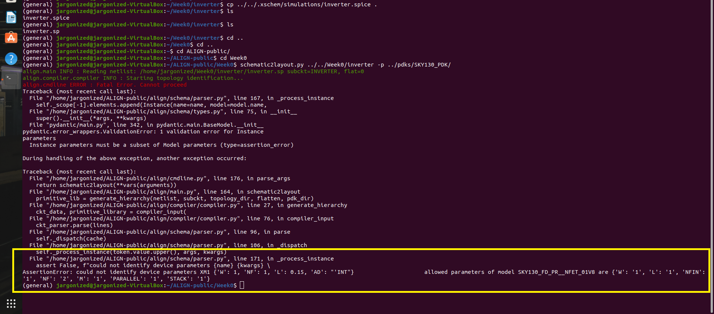 | 
| 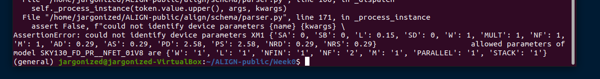 | 

  
# Bibliography

1. https://www.youtube.com/watch?v=NUahmUtY814
2. https://github.com/bluecmd/learn-sky130/blob/main/schematic/xschem/getting-started.md
3. https://github.com/yathAg/Physical_Verification_SKY130A/
4. https://github.com/Avnish21/VSD-Physical-Verification-Using-Sky130/blob/main/README.md

